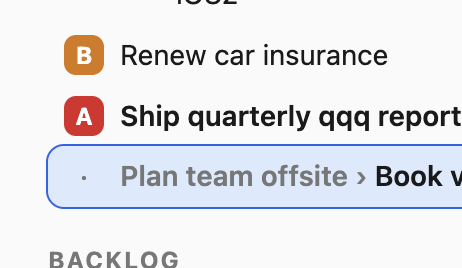

* DONE [#B] Renew car insurance :paperwork:
  CLOSED: [2026-07-19 Sun 12:15] DEADLINE: <2026-07-20 Mon>
  :PROPERTIES:
  :Effort:   1h
  :ADDED:    [2026-07-14 Tue]
  :END:
  
* DONE [#C] Garage cleanup
  CLOSED: [2026-07-18 Sat 12:31]
  :PROPERTIES:
  :Effort:   4h
  :END:
* DONE prepare breakfast
  CLOSED: [2026-07-19 Sun 12:15]
  :PROPERTIES:
  :ADDED:   [2026-07-18 Sat]
  :END:
* DONE Get work done
  CLOSED: [2026-07-19 Sun 12:15]
  :PROPERTIES:
  :ADDED:   [2026-07-18 Sat]
  :END:
* DONE [#A] go to ikea :ikea:buy:
  CLOSED: [2026-07-19 Sun 12:15] DEADLINE: <2026-07-18 Sat>
  :PROPERTIES:
  :ADDED:   [2026-07-18 Sat]
  :END:
* TODO Write performance reviews :work:
  :PROPERTIES:
  :ADDED:   [2026-07-18 Sat]
  :END:
** DONE Vladimir
  CLOSED: [2026-07-19 Sun 12:16]
  :PROPERTIES:
  :ADDED:   [2026-07-18 Sat]
  :Effort:   1h
  :END:
** DONE Ed
  CLOSED: [2026-07-19 Sun 12:16]
  :PROPERTIES:
  :ADDED:   [2026-07-19 Sun]
  :END:
** NEXT Elena
  :PROPERTIES:
  :ADDED:   [2026-07-19 Sun]
  :END:
* TODO [#A] go to grocery store
  DEADLINE: <2026-07-19 Sun>
  :PROPERTIES:
  :ADDED:   [2026-07-19 Sun]
  :END:
